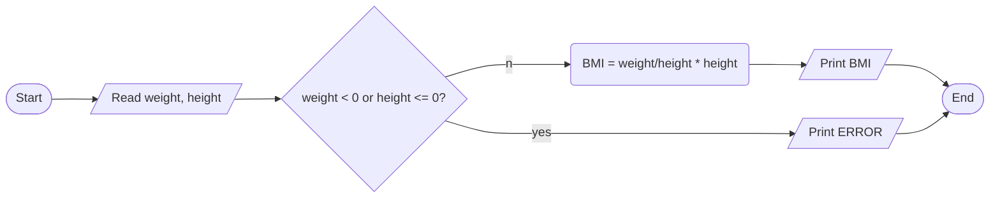

Problem: Reading height and weight of a person and output BMI

INPUT

-height
-weight

OUTPUT

-BMI

PROCESS

-BMI = weight/)height * height

ALGORITHM(PSEUDOCODE)

2. read height and weight
3. if height or weight is negative or height is zero, display error message and error out
4. bmi = weight/(height * height)
5. print bimi
6. end

ALGORITHM(FLOWCHART)

PROGRAM DESIGN

1. Declare three variable - height, weight, bmi. The quantities are not-so-big continuous numbers. float type will do.
2. Read height and weight respectively in one go, separated by space. So cin can do that.
3. Check if height is less than or equal to zero or weight is less than zero. If it is, that's error. Display error and exit.
4. calculate bmi by - bmi = weight/(height * height)
5. Print bmi in informative way. Cout object will take care of that.
6. exit successfully

