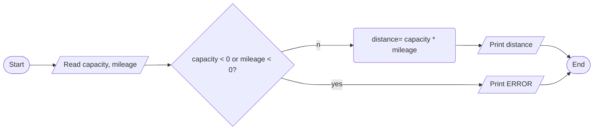

Problem: Predicting mileage of an automobile by fuel tank capacity and fuel required by distance. Fuel capacity and mileage(miles per unit amount fule) are inputs.

INPUT

- fuel tank capacity(in gallons)
- miles per gallon of fuel( efficiency ) of the automobile (in gallons)

OUTPUT

- maximum distance the automobile can travel without refueling(in miles)

PROCESS

- distance = mileage(miles per gallon) * capacity(gallon)

ALGORITHM(PSEUDOCODE)

1. start
2. read fuel capcity and mileage
3. if invalid input, print error and exit unsuccessfully. Negative values are invalid.
4. distance = capacity * mileage
5. print distance
6. end

ALGORITHM(FLOWCHART)

PROGRAM DESIGN

1. Declare three variables - capacity, mileage and distance. They take continuous values. So float data type. All initialized to 0.
2. Read capacity and mileage as space separated values. Cin is well suited for the job.
3. Check the validity of the read values. if values are negative, error and exit.
4. Calculate distance ; distance = capacity * mileage.
5. Print distance in informative way.
6. exit successfully
