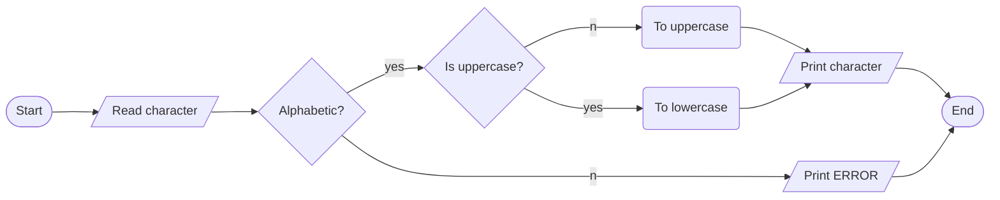

PROBLEM: Change the case of a character. If in uppercase, change to lowercase and vice versa

INPUT

- A character value

OUTPUT

- Changed character value

PROCESS

- Use case changing functions from ctype standard library - toupper(char) and tolower() functions.:

ALGORITHM(PSEUDOCODE)

1. start
2. read a character from the keyboard
3. check if a valid character. Only alphabetic characters are accepted.
4. if invalid, print error and end
5. convert the case.
6. print the converted character value.
7. end

ALGORITHM(FLOWCHART)

PROGRAM DESIGN

1. start
2. declare two character variables, one for input and another for changed value
3. check if the value is in [a-z] or [A-Z] range. Use isalpha(char) cctype.h. If not display error message and exit
4. flip the case by using toupper() and tolower() functions.
5. print the changed value
6. exit successfully

