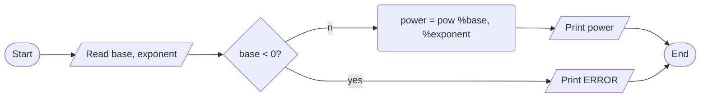

PROBLEM: Find the value of x raised to y when x and y are use inputs.

INPUT

- x value
- y value

OUTPUT

- the value of x raised to y

PROCESS

- Use power(double, double) from cmath library

ALGORITHM(PSEUDOCODE)

1. start
2. read two decimals,  one base and another exponent
3. if base <= 0, print error and exit
4. power = pow(base, exponenet)
5. print power
6. end

ALGORITHM(FLOWCHART)

PROGRAM DESIGN

- declare three variable, one for base, one for exponent and another for power value. Since pow function takes double values and returns double value, they have to be double
- read base and exponent
- check validity. If base is non-positive, invalid so print error and exit. Use if construct.
- invoke pow function get the value in power variable
- print power
- exit successfully
