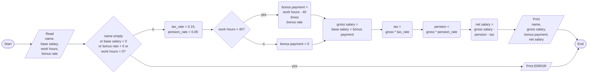

PROBLEM: Determine the gross salary, net salary and bonus payment of an employee from work hours, bonus rate and base salary. Income tax and pension are to be deducted at the end. Base salary, name, bonus rate and work hours are user inputs.

INPUT

- name
- work hours
- bonus rate
- base salary

OUTPUT

- name
- gross salary
- bonus payment
- net salary

PROCESS

- Calculate bonus payment for work hours in excess of 40 based on bonus rate, i.e 
    if work hour is greater than 40, bonus payment = (work hours - 40) times bonus rate
- gross salary is base salary plus bonus payment
- pension = pension rate * gross salary
- income tax = gross salary * tax rate
- net income = gross salary - pension - income tax

ALGORITHM(PSEUDOCODE)

1. start
2. read name, base salary, work hours and bonus rate
3. if invalid input, error and exit. Invalid inputs are negative numbers and empty name.
4. if work hours > 40, then bonus payment = (work hours - 40 ) * bonus rate else zero
5. gross salary = base salary + bonus payment
6. pension = gross * pension rate
7. tax = gross * tax rate
8. net salary = gross salary - pension - tax
9. print name, gross salary, bonus payment, net salary
10. end

ALGORITHM(PSEUDOCODE)

PROGRAM DESIGN

1. declare fixed constant variables for tax rate and pension rate with values 0.15 and 0.5 respectively
2. declare integer value for working hours
3. declare a variable of string type for storing name
4. declare floating point variables for base salary and bonus rate
5. declare floating point variables for gross salary, net salary, bonus payment
6. read name, base salary, work hours, bonus rate
7. if name is empty or any of base salary or work hours or bonus rate is negative, display error exit.
8. if work hour > 40, then bonus = bonus_rate * ( work_hour - 40 )
9. gross = base + bonus
10. pension = gross * pension_rate
11. tax = gross * tax_rate
11. net = gross - tax - pension
12. Print gross, bonus and net with cout 
13. exit successfully.
