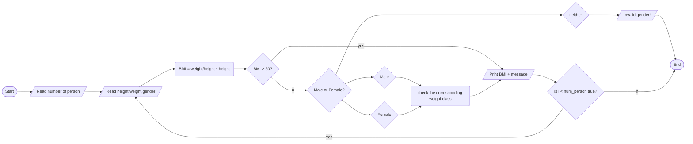

BMI_v2

1. Problem Description

- Write a program that calculates the BMI of a person. The program should read inputs from the user such as number of person weight, height, and gender.

2. Problem Analysis

   - Input: height and weight.
   - Process: BMI = weight/(height\*height)
   - Output: BMI

3. Algorithm
   1. Start
   2. Declare variables
      - height, weight, gender,number of person
   3. prompt the user to enter height, weight, number of person, and gender
   4. Read user input on height and weight
   5. Calculate BMI
      - BMI = weight / (height \* height)
   6. If BMI > 30
      - Print BMI + message
   7. else
      - read user input into gender
   8. If gender is "male"
      - Print BMI + message
   9. Else If gender is "female"
      - Print "BMI + message
   10. Read user input into number of person
   11. If i < number of person
       - go back to step 3
   12. else
       - end

Algorithm: Flowchart



```

4. Program Design
   1. Declare variables for height, weight, gender and BMI
   2. Print prompts the user to input weight, height and gender
   3. Read user input into weight and height variables
   4. Calculate BMI by dividing weight by height squared
   5. if BMI is greater than 30 print out a message with the calculated BMI
   6. Read user input for gender
   7. if gender is male print out a message with corresponding weight with his BMI
   8. if gender is female print out a message with corresponding weight with her BMI
   9. if user input invalid gender print out a message
   10. End
```
