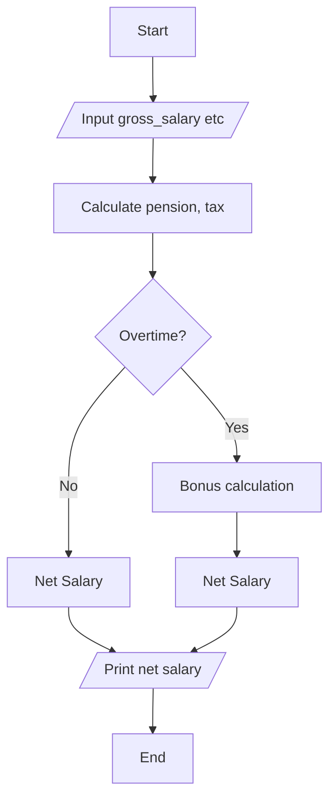

1. Problem Description
   - Write a program to calculate net income given gross salary, tax rate, pension rate,working_hour and bonus_rate

2. Problem Analysis
   - Input: gross salary, tax rate, working hours
   - Process: Calculate pension, income tax, net salary,bonus and ovetime ,
   - Output: Net salary

3. Algorithm
   1. Start
   2. Declare constants and variables  
      - PENSION_RATE, overtime, gross_salary etc
   3. Read inputs   
      - gross_salary, bonus_rate, working_hours, tax_rate
   4. Calculate pension and income tax
   5. Check if overtime
      - Calculate bonus
   6. Calculate net salary with/without overtime 
   7. Print net salary
   8. End

4.Algorithm(Flowchart)
 

