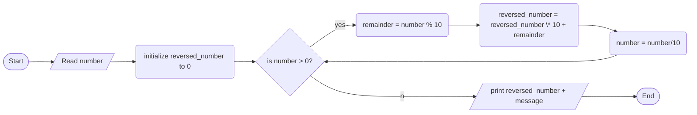

1. Problem Description

- We want to write a C++ program to reverse a number entered by the user. For example, if the user enters 12345, the program should output 54321.

2. Problem Analysis:

   1. Input: A positive integer number
   2. Process:
      - Initialize a variable called reversed_number to store the reversed number, initialize it to 0.
      - Use a while loop to repeatedly extract the last digit from num and add it to reversed_number
      - Break when num reaches 0
   3. Output: Print out reversed_number

3. Algorithm:

   1. Start
   2. Get integer num as input from the user
   3. Initialize reversed_number to 0
   4. While num > 0
      - Remainder = num % 10
      - reversed_number = reversed_number \* 10 + remainder
      - num = num / 10
   5. Print reversed_number
   6. End

4. Algorithm(Flowchart)

