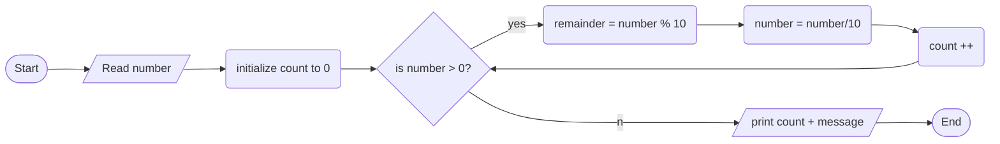

1. Problem Description

- we want to write a program that can count the number of digits in a positive integer entered by the user.

2. Problem Analysis

   1. input - integer number
   2. process:
      - Initialize a digit counter variable to 0
      - Extract the last digit using the modulo 10 operator
      - Repeat while the integer is greater than 0
      - Increment the digit counter variable
      - Remove the last digit by integer dividing the number by 10
      - After the loop, the digit counter variable contains the total digits
   3. output- total number of digits

3. Algorithm

   1. Start
   2. Read num (get integer input from the user)
   3. Initialize count to 0
   4. While num is greater than 0
      - Remainder = num modulo 10
      - Count = count + 1
      - Num = num /= 10
   5. Print "The number has" + count + "digits"
   6. End

4. Algorithm(Flowchart)

