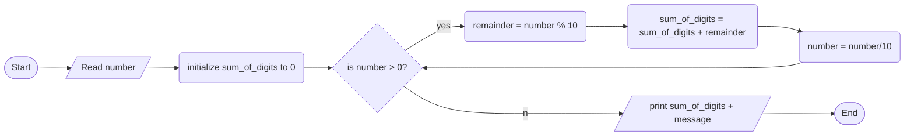

1. Problem Description:

- We want to write a C++ program that calculates the sum of the digits of a number the user inputs

2. Problem Analysis:

   1. Input: A positive integer entered by the user
   2. Process:
      - Initialize a variable called sum_of_digits to store the sum, initialize to 0
      - Extract the last digit of the number using % 10
      - Add this digit to sum_of_digits
      - Remove the last digit from the number by dividing it by 10
      - Repeat the steps above in a loop until the original number reaches 0
   3. Output:
      - Print out the final sum_of_digits

3. Algorithm:

   1. Start
   2. Get integer num as input from the user
   3. Initialize sum_of_digits to 0
   4. While num > 0
      - Remainder = num % 10
      - sum_of_digits = sum_of_digits + remainder
      - num = num / 10
   5. Print sum_of_digits
   6. End

4. Algorithm(Flowchart)

