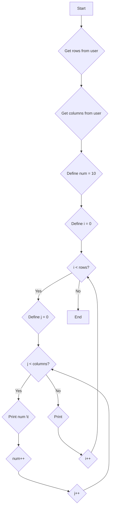

1. Problem Description
Print a pattern of increasing numbers in a tabular format based on user input for number of rows and columns.

2. Problem Analysis   
- Inputs:  
    - Rows (number of rows for pattern)
    - Columns (number of columns for pattern)
- Process:
    - Use nested loops to print numbers 
        - Outer loop controls rows
        - Inner loop controls columns
    - Print numbers in sequence, incrementing by 1 after each print
    - Add tab spacing between numbers  
    - Move to next line after each row
- Outputs:  
    - Number pattern based on input rows and columns
3. Algorithm

    1. Start
    2. Take rows and columns input from user
    3. Initialize number (num) to 1 
    4. Use outer for loop from 0 to (rows - 1)
    5. Inside outer loop use inner for loop from 0 to (cols - 1)
    6. Print num and add tab spacing (\t)
    7. Increment num after printing each number
    8. After inner loop finishes one row, print new line
    9. Repeat steps 4 to 7 until outer loop finishes all rows
    10. Exit

4. Algoritm (Flowchart)


```