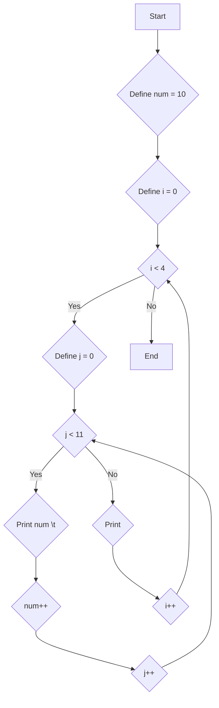

1. Problem Description
Print a pattern of increasing numbers in a tabular format with 4 rows and 11 columns.

2. Problem Analysis  
- Input: None
- Process: Use nested loops 
    - Outer loop controls rows
    - Inner loop controls columns 
    - Print numbers in increasing order
- Output: Number pattern

3. Algorithm

    1. Start
    2. Initialize number num to 10
    3. Use outer loop from 0 to 3 (for 4 rows)
    4. Inside outer loop use inner loop from 0 to 10 (for 11 columns) 
    5. Print num and a tab space  
    6. Increment num after printing
    7. After inner loop prints one row, print a new line 
    8. Repeat steps 3-6 to print 4 rows 
    9. End

4. Algorithm(FLowchart)

