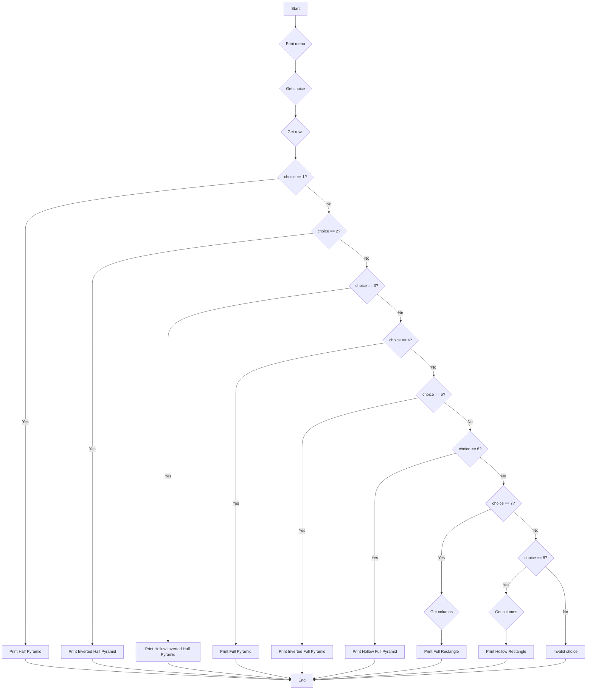

1. Problem Description 
Print different types of pyramid and rectangle patterns based on user choice of pattern and input number of rows and columns.

2. Problem Analysis
Inputs:
    Choice of pattern
    Number of rows
    Number of columns (for rectangles)
Processing:
    Use nested loops to print patterns
        Outer loop controls rows
        Inner loop prints each row
    Print '*' and spaces to shape patterns
    Vary inner loop iterations, spacing and print logic per shape
Outputs:
        Different pyramid patterns
        Rectangular patterns

3. Algortihm

   1. Start
   2. Display menu for shape choice
   3. Take choice input  
   4. Take rows input 
   5. If choice is 7 or 8 (rectangles)    
      - Take columns input
   6. Use nested loops:
      - Outer loop from 1 to rows  
   7. Shape specific logic:
      - Choice 1 - Half pyramid:
         - Inner loop from 1 to i (outer counter)
         - Print "*" in inner loop 
      - Choice 2 - Inverted half pyramid:  
         - Inner loop from i (outer counter) to 1
         - Print "*" in inner loop
      - Choice 3 - Hollow inverted half pyramid:
         - Inner loop from 1 to i (outer counter) 
         - Print "*" if first/last column or outer row
         - Else print space 
      - Choice 4 - Full pyramid:
         - Inner loop prints spaces = rows - i 
         - Inner loop to print "*" from 1 to 2*i - 1
      - Choice 5 - Inverted full pyramid 
         - Print "*" if corner or diagonal 
      - Choice 6 - Hollow full pyramid
         - Inner loop prints spaces = rows - i
         - Print "*" if first or last row
         - Else print "*" and spaces between
      - Choice 7 - Full rectangle
         - Inner loop prints "*" till columns
      - Choice 8 - Hollow rectangle 
         - Print "*" if first/last row/column
         - Else print space
   8. Print new line after inner loop ends
   9. Repeat steps 5-7 based on choice  
   10. End

4. Algortihm(Flowhcart)

