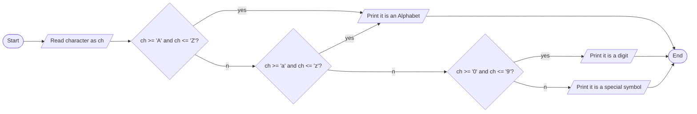

1. Problem Description
- Write a program that checks if a given character entered by the user is an alphabet, number, or special symbol.

2. Problem Analysis 
Input: 
    - Character entered by user
Process:
    - Read input character from user
    - Check if character is:
    - Alphabet (A-Z or a-z)
    - Digit (0-9)
    - Special symbol (anything other than alphabet or digit)
    - Print whether input character is alphabet, digit, or special symbol
Output: 
    - "Alphabet" if ch is A-Z or a-z
    - "Digit" if ch is 0-9
    - "Special symbol" for any other character

3. Algorithm
    1. Start 
    2. prompt the user to input a character
    3. Read input character from the user into ch
    4. Check if ch >= 'A' and ch <= 'Z', print "Alphabet"
    5. Else check if ch >= 'a' and ch <= 'z', print "Alphabet" 
    6. Else check if ch >= '0' and ch <= '9', print "Digit"
    7. Else print "Special symbol"
    8. Stop

4. Algorithm(Flowchart)

