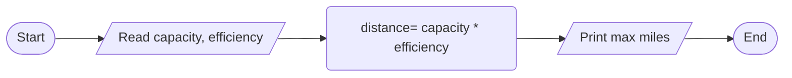

Mileage

1. Problem Description
- Write a program to calculate the maximum miles a car can be driven before needing to refuel based on fuel tank capacity and fuel efficiency.

2. Problem Analysis
- Inputs: Fuel tank capacity (gallons), Fuel efficiency (miles per gallon)
- Process: Calculate maximum miles = Fuel tank capacity \* Fuel efficiency
- Output: Maximum miles

3. Algorithm
   1. Start
   2. Prompt user to input fuel tank capacity
   3. Read fuel tank capacity input
   4. Prompt user to input fuel efficiency
   5. Read fuel efficiency input
   6. Calculate maximum miles = fuel tank capacity \* fuel efficiency
   7. Print maximum miles
   8. End

Algorithm: Flowchart

4. Program Design
   1. Declare variables for fuel tank capacity, fuel efficiency, maximum miles
   2. Print "Enter fuel tank capacity (gallons):"
   3. Read user input for fuel tank capacity
   4. Print "Enter fuel efficiency (mpg):"
   5. Read user input for fuel efficiency
   6. Calculate maximum miles = fuel tank capacity \* fuel efficiency
   7. Print output prompt message ("Maximum miles: ") and process result (maximum miles).
   8. End program

