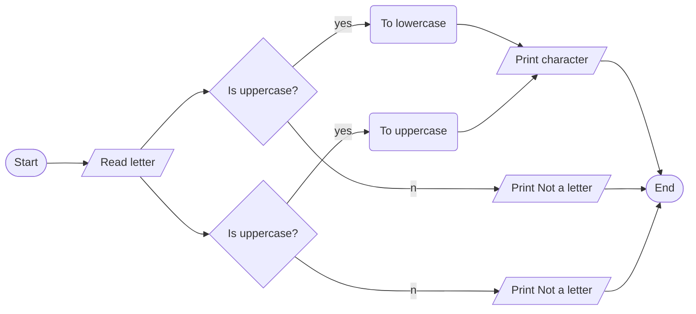

Letter case conversion

1. Problem Description
- Write a program to convert a letter input by the user to the opposite case (upper to lower or lower to upper).
2. Problem Analysis
- Input: A letter (char)
- Process: 
- Check if the letter is uppercase using isupper()
- If yes, convert to lowercase using tolower()
- Check if the letter is lowercase using islower()
- If yes, convert to uppercase using toupper()
- Output: The converted letter in the opposite case
3.  Algorithm
  -  Start
  - Prompt the user to input a letter
  -  Read user input into the letter
  -  if letter is uppercase: Convert the letter to lowercase
  -  Else if the letter is lowercase: Convert the letter to uppercase
  -  Else: Print "Not a letter"
  -  Print converted letter
  -  End

Algorithm: Flowchart

4. Program Design
   1. Import cctype library
   2. Declare letter variable (char)
   3. print a prompt for the user’s input "Enter a letter: "
   4. Read user input into the letter
   5. If isupper(letter) 
   6. Print converted lowercase letter
using tolower()
   8. Else if islower(letter) 
   &. Print converted uppercase letters using toupper()
   9. Else 
   10. Print "Not a letter"

