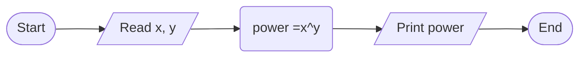

Power

1. Problem Description
- Write a program to calculate x raised to the power y based on user input.
2. Problem Analysis
- Inputs: x (base number), y (exponent)
- Process: Calculate x^y using pow() function
- Output: x^y result
3. Algorithm
   1. Start
   2. Prompt the user to input x and y
   3. Read x input and y input
   4. Calculate result = pow(x, y)
   5. Print x^y = result
   6. End

Algorithm: Flowchart

4. Program Design
   1. Import cmath library
   2. Declare x, y, result variables
   3. Print "Enter x:"
   4. Read user input for xPrint "Enter y:"
   5. Read user input for y
   6. Calculate result = pow(x, y)
   7. Print x + "^" + y + " = " + result
   8. End program

