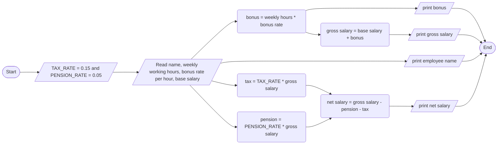

Salary

1. Problem Description
- Write a program to calculate an employee's gross and net salary based on hours worked, bonus rate, base salary, tax rate, and pension rate.
2. Problem Analysis
- Inputs: Employee name, Weekly working hours, Bonus rate per hour, Base salary
- Processing:
- Calculate bonus = Weekly hours \* Bonus rate
- Calculate gross salary = Base salary + Bonus
- Calculate tax = TAX\_RATE \* Gross salary
- Calculate pension = PENSION\_RATE \* Gross salary
- Calculate net salary = Gross salary - Tax - Pension
- Outputs: Employee name, Gross salary, Net salary, Bonus amount
3. Algorithm
   1. Start
   2. Define tax rate as 0.15 and pension as 0.05
   3. Input employee name
   4. Input weekly working hours
   5. Input bonus rate per hour
   6. Input base salary
   7. Calculate bonus = weekly hours \* bonus rate
   8. Calculate gross salary = base salary + bonus
   9. Calculate tax = TAX\_RATE \* gross salary
   10. Calculate pension = PENSION\_RATE \* gross salary
   11. Calculate net salary = gross salary - tax – pension
   12. Print employee name, gross salary, net salary, bonus
   13. End

Algorithm: Flowchart

4. Program Design
   1. Include iostream, string
   1. Define TAX\_RATE and PENSION\_RATE
   1. Declare name, weeklyHours, bonusRate, baseSalary, grossSalary, netSalary, bonus, tax, pension
   1. Input name
   1. Input weeklyHours
   1. Input bonusRate
   1. Input baseSalary
   1. Calculate bonus, grossSalary, tax, pension, netSalary
   1. Print name, grossSalary, netSalary, bonus
   1. End
