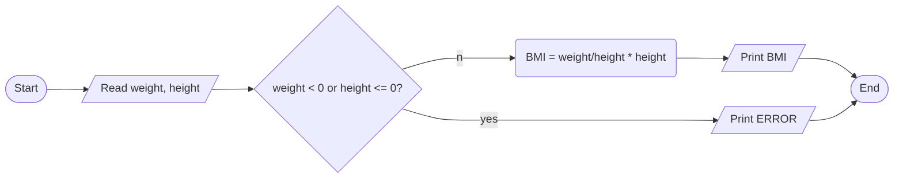

ANALYSIS 

INPUT 

-height
-weight 

OUTPUT 

-BMI 

PROCESS 

-BMI = weight/)height * height 

ALGORITHM
 
  FLOWCHART

 PSEUDOCODE

1. start
2. read height and weight
3. if height or weight is negative or height is zero, display error message and error out
4. bmi = weight/(height * height)
5. print bmi
6. end 

