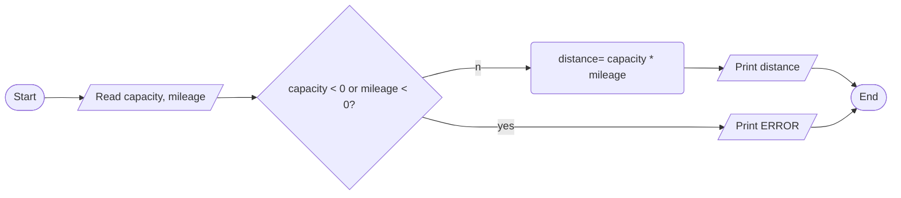

ANALYSIS

INPUT 

- fuel tank capacity(in gallons)
- miles per gallon of fuel( efficiency ) of the automobile (in gallons) 

OUTPUT 

- maximum distance the automobile can travel without refueling(in miles) 

PROCESS 

- distance = mileage(miles per gallon) * capacity(gallon) 

FLOWCHART

ALGORITHM 

1. start
2. read fuel capcity and mileage
3. if invalid input, print error and exit unsuccessfully. Negative values are invalid.
4. distance = capacity * mileage
5. print distance
6. end
