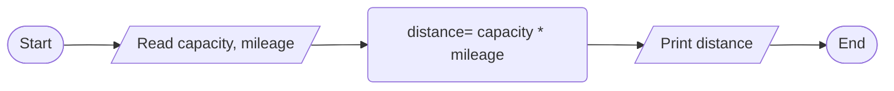

ANALYSIS

INPUT 

- fuel tank capacity(in gallons)
- miles per gallon of fuel( efficiency ) of the automobile (in gallons) 

OUTPUT 

- maximum distance the automobile can travel without refueling(in miles) 

PROCESS 

- distance = mileage(miles per gallon) * capacity(gallon) 

ALGORITHM 

 FLOWCHART

 PSEUDOCODE
 
1. start
2. read fuel capcity and mileage
3. distance = capacity * mileage
4. print distance
5. end
