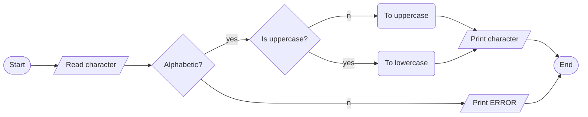

ANALYSIS

INPUT

- A character value

OUTPUT

- Changed character value

PROCESS

- Use case changing functions from ctype standard library - toupper(char) and tolower() functions.:

ALGORITHM

 FLOWCHART

 PSEUDO CODE
1. start
2. read a character from the keyboard
3. check if a valid character. Only alphabetic characters are accepted.
4. convert the case.
5. print the converted character value.
6. end

