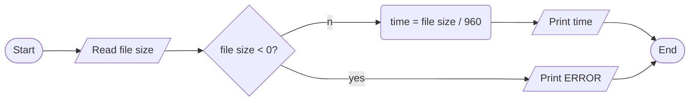

ANALYSIS

INPUT

- file size

OUTPUT

- transmission time

PROCESS

- transmission time = file size / transmission rate

ALGORITHM

 FLOWCHART

 PSEUDOCODE
 
1. start
2. read file size
3. if size < 0, print error and exit 
4. time = file size / 960
5. print time
6. end
