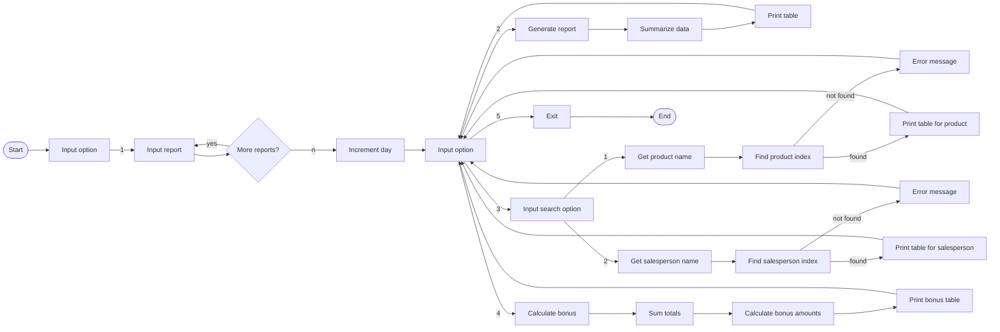

Algorithm(Flowchart)

```mermaid
graph LR;
    id1([Start])-->id2[Input option]
    id2--1-->id3[Input report]
    id3-->id4{More reports?}
    id4--yes-->id3
    id4--no-->id5[Increment day]
    
    id5-->id6[Input option] 
    id6--2-->id7[Generate report]
    id7-->id8[Summarize data]
    id8-->id9[Print table]
    id9-->id6
    
    id6--3-->id10[Input search option]
    id10--1-->id11[Get product name]
    id11-->id12[Find product index]
    id12--not found-->id13[Error message]
    id13-->id6
    id12--found-->id14[Print table for product]
    id14-->id6
    
    id10--2-->id15[Get salesperson name]
    id15-->id16[Find salesperson index]
    id16--not found-->id17[Error message]
    id17-->id6
    id16--found-->id18[Print table for salesperson]
    id18-->id6

    id6--4-->id19[Calculate bonus]
    id19-->id20[Sum totals]
    id20-->id21[Calculate bonus amounts]
    id21-->id22[Print bonus table]
    id22-->id6

    id6--5-->id23[Exit]
    id23-->id24([End])
```